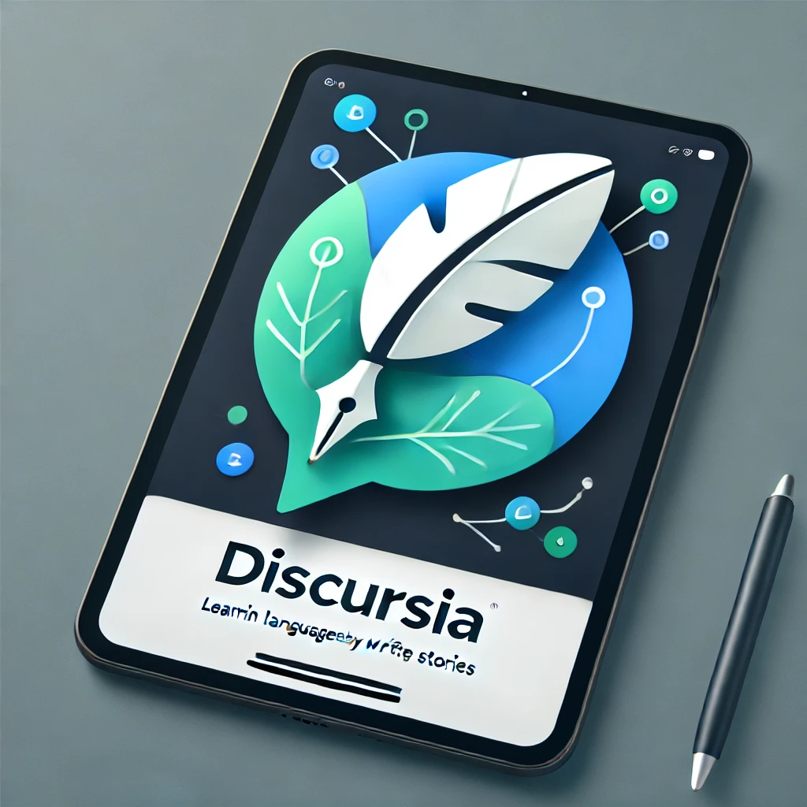

# Discursia: A Language-Learning App

Discursia is a mobile application designed to enhance language-learning experiences by engaging users in meaningful discussions on various topics. It utilizes the power of LLMs (Large Language Models) to suggest topics, evaluate user inputs, and provide feedback to improve language skills. The app is built with Flutter, leveraging Firebase for backend services.



## Features

* **Topic Suggestion** : Dynamically generates discussion topics to keep users engaged.
* **User Input Evaluation** : Assesses user responses for grammar, clarity, and topic relevance, providing actionable feedback.
* **Answer Suggestions** : Offers model-generated answers to help users learn through examples.
* **Past Interactions** : Allows users to revisit past themes, responses, and evaluations for continuous improvement.
* **Multi-Screen Functionality** : Supports login, signup, and discussion screens with a seamless UI.
* Multi Language support : English, German, French, Italian, Portuguese, Hindi, Spanish, Thai

---

## Project Structure

```
lib
├── api
│   └── llmservice.dart      # Interface with the language model
├── db
│   ├── auth_google.dart     # Google authentication integration
│   ├── discusia.dart        # Firebase database interaction
│   ├── discussion.dart      # Discussion model logic
│   └── model.dart           # Core data models
├── firebase_options.dart    # Firebase configuration
├── main.dart                # App entry point
├── screens
│   ├── home.dart            # Home screen UI
│   ├── login.dart           # Login screen UI
│   └── signup.dart          # Signup screen UI
├── utilities
│   ├── api_key.dart         # API key management
│   ├── prompts.dart         # Predefined prompts for discussions
│   ├── storage_manager.dart # Handles local storage
│   └── topic_management.dart # Topic generation and management
└── widgets
    ├── card_builder.dart    # Dynamic card creation
    ├── config.dart          # App configuration settings
    ├── detail.dart          # Detailed view for discussions
    ├── eval.dart            # Evaluation logic
    ├── history.dart         # View for past discussions
    ├── suggest.dart         # Topic suggestion logic
    ├── themeselector.dart   # Theme customization
    └── writing.dart         # Writing input UI
```

---

## Installation

### Prerequisites

* Flutter SDK installed ([installation guide](https://flutter.dev/docs/get-started/install))
* Firebase project set up with required configurations
* Dart enabled in your IDE (e.g., Android Studio, VS Code)

### Steps to Run the App

1. **Clone the Repository:**
   ```bash
   git clone https://github.com/KameniAlexNea/learning_language.git
   cd learning_language
   ```
2. **Set Up Firebase:**
   * Replace `firebase_options.dart` with your Firebase configuration.
   * Ensure Firebase services like Firestore and Authentication are enabled.
3. **Install Dependencies:**
   ```bash
   flutter pub get
   ```
4. **Run the App:**
   ```bash
   flutter run
   ```

---

## Usage

1. **Sign Up and Log In:**
   * Users can create an account or log in via Google authentication.
2. **Explore Topics:**
   * Navigate to the home screen to view or request new discussion topics.
3. **Submit Responses:**
   * Write your response to the suggested topic and receive detailed feedback.
4. **Review Past Discussions:**
   * Access the history screen to revisit past discussions and their evaluations.
5. **Customize the Experience:**
   * Use the theme selector to tailor the app’s look and feel.

---

## Contributing

Contributions are welcome! To contribute:

1. Fork the repository.
2. Create a new feature branch:
   ```bash
   git checkout -b feature/your-feature-name
   ```
3. Commit your changes and push the branch:
   ```bash
   git push origin feature/your-feature-name
   ```
4. Create a pull request for review.

---

## License

This project is licensed under the **GNU Affero General Public License (AGPL)** License. See the [LICENSE](https://www.gnu.org/licenses/agpl-3.0.en.html#license-text) file for more details.

---

## Contact

For questions, feedback, or collaboration opportunities, please contact [alexneakameni](https://www.linkedin.com/in/elie-alex-kameni-ngangue/).
